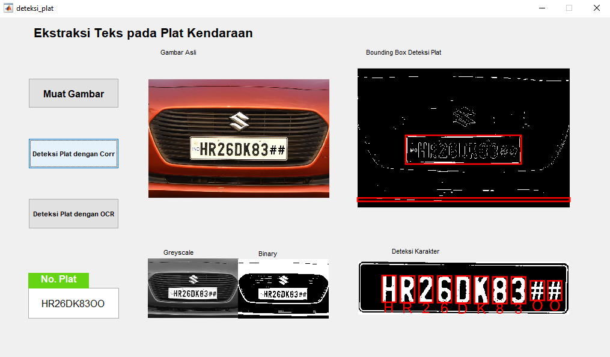
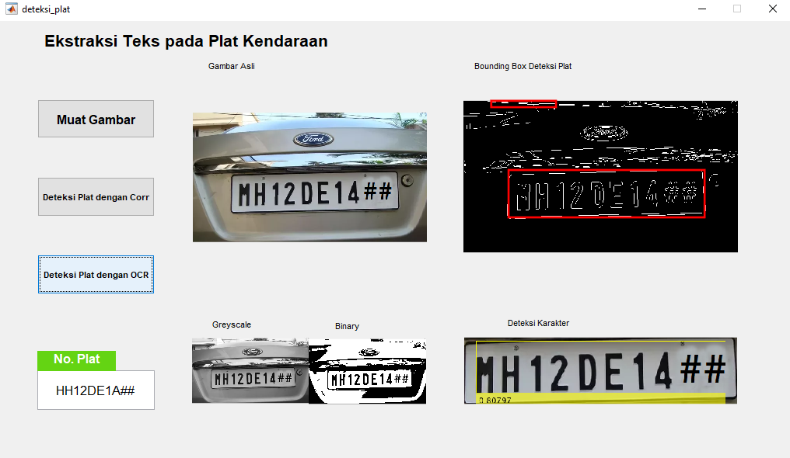

# Proyek Pengolahan Citra Digital: Deteksi Nomor Plat Kendaraan Bermotor

Deteksi karakter teks pada plat kendaraan bermotor merupakan langkah penting dalam pengembangan sistem deteksi plat kendaraan. Teknologi Optical Character Recognition (OCR) memungkinkan sistem untuk secara otomatis mengenali karakter teks yang tercetak pada plat kendaraan bermotor, baik itu nomor plat kendaraan, huruf, angka, maupun simbol lainnya. Pengenalan karakter teks ini menjadi bagian integral dari proses deteksi plat kendaraan.

## Batasan Masalah
1.  Karakter yang dikenali adalah huruf A-Z dan angka 0-9
2.  Implementasi dilakukan menggunakan MATLAB GUI dengan masukan Gambar secara manual

## Metodologi
Metode yang digunakan dalam proses pengenalan citra, diantaranya:
1.  Correlation Coefficient 
Metode ini membandingkan matriks yang merepresentasikan nilai citra input dengan citra karakter A-Z yang telah disiapkan. Citra karakter uji merepresentasikan masing-masing karakter A-Z0-9 dengan ukuran 24x42 piksel dan berformat bpm. 
2.  OCR dalam aplikasi MATLAB Image Processing 
Metode ini mengimplementasikan library OCR yang tersedia dalam aplikasi Image Processing pada MATLAB.

## Hasil
1.  Correlation Coefficient 

2.  OCR dalam aplikasi MATLAB Image Processing 
